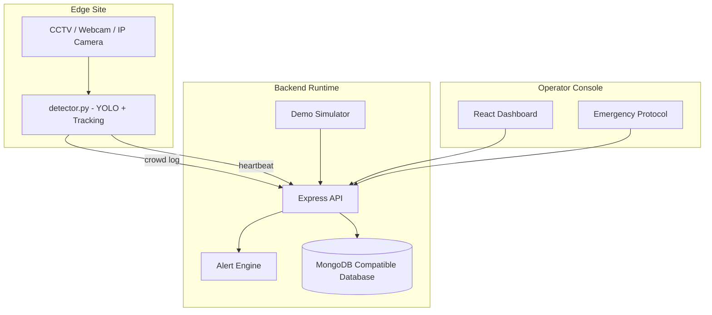
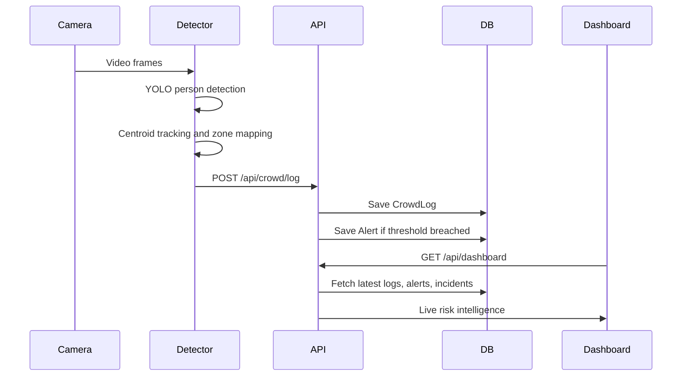
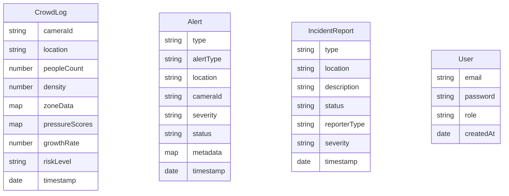
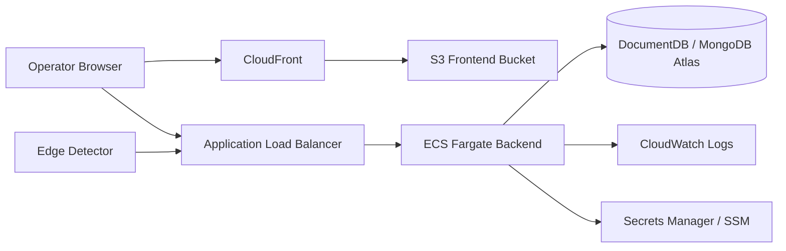

# Guardian Vision Architecture

## High-Level Architecture

Guardian Vision has three major runtime surfaces:

- **Frontend dashboard**: React/Vite operator UI.
- **Backend API**: Express service that stores logs, creates alerts, and aggregates dashboard data.
- **Edge detector**: Python YOLO process that performs local video inference.

## Low-Level Design

### Frontend

- `src/App.jsx`: route definitions and basic route protection.
- `src/pages/Dashboard.jsx`: primary command center and action workflow.
- `src/pages/Incidents.jsx`: incident management.
- `src/pages/Analytics.jsx`: chart-based analytics.
- `src/pages/Docs.jsx`: camera/demo documentation surface.
- `src/pages/EmergencyProtocol.jsx`: emergency response workflow.
- `src/lib/api.js`: API fetch wrapper and base URL handling.

### Backend

- `server/index.js`: Express app, runtime state, routes, simulator, detector process control.
- `server/models.js`: Mongoose schemas.

### AI Detector

- `detector.py`: video capture, YOLO inference, centroid tracking, zone assignment, backend reporting.

## Data Flow

## Database Schema

## Deployment Diagram

## Production Notes

- Keep the detector near the camera source for lower latency and lower cloud cost.
- Use the backend as the source of truth for alerts and incidents.
- Add indexes on `timestamp`, `cameraId`, `status`, and `severity`.
- Replace demo auth before production use.

