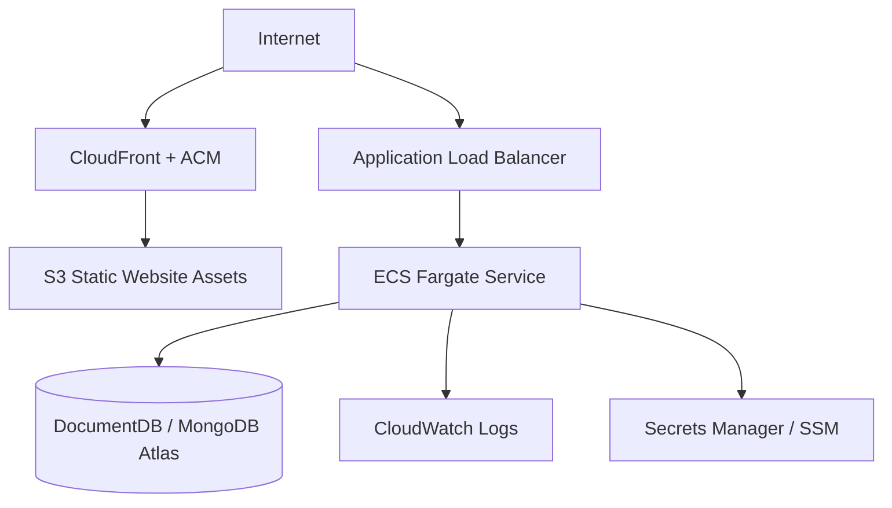

# AWS Deployment Guide

This guide describes a production-ready AWS target architecture for Guardian Vision.

## AWS Services

- Amazon S3 and CloudFront for frontend hosting.
- AWS Certificate Manager for TLS.
- Route 53 for DNS.
- Amazon ECR for backend images.
- Amazon ECS Fargate for the Express API.
- Application Load Balancer for HTTPS ingress.
- Amazon DocumentDB or MongoDB Atlas for persistence.
- Secrets Manager or SSM Parameter Store for secrets.
- CloudWatch Logs, Metrics, and Alarms for operations.
- AWS Budgets for cost control.

## Recommended Topology



## Backend Container Build

```bash
docker build -f docker/backend.Dockerfile -t guardian-vision-api .
```

## ECR Push

```bash
aws ecr create-repository --repository-name guardian-vision-api
aws ecr get-login-password --region <region> | docker login --username AWS --password-stdin <account-id>.dkr.ecr.<region>.amazonaws.com
docker tag guardian-vision-api:latest <account-id>.dkr.ecr.<region>.amazonaws.com/guardian-vision-api:latest
docker push <account-id>.dkr.ecr.<region>.amazonaws.com/guardian-vision-api:latest
```

## Frontend Build

```bash
npm ci
npm run build
aws s3 sync dist/ s3://<frontend-bucket> --delete
aws cloudfront create-invalidation --distribution-id <distribution-id> --paths "/*"
```

## Required Backend Secrets

Store these in Secrets Manager or SSM:

- `MONGO_URI`
- `MASTER_ADMIN_EMAIL`
- `MASTER_ADMIN_PASSWORD`
- `GUARDIAN_STREAM_TOKEN`
- `SURGE_RATE_THRESHOLD`

## Security Groups

- ALB accepts `443` from internet.
- ECS accepts backend port only from ALB security group.
- Database accepts MongoDB port only from ECS security group.
- No direct public database access.

## Cost Controls

- Start with one small Fargate task.
- Keep detector inference on edge hardware.
- Add AWS Budget alerts.
- Clean unused ECR images and old CloudWatch logs.

## Rollback

Rollback backend:

```bash
aws ecs update-service --cluster <cluster> --service <service> --task-definition <previous-task-definition>
```

Rollback frontend:

```bash
aws s3 sync <backup-dist-path>/ s3://<frontend-bucket> --delete
aws cloudfront create-invalidation --distribution-id <distribution-id> --paths "/*"
```

